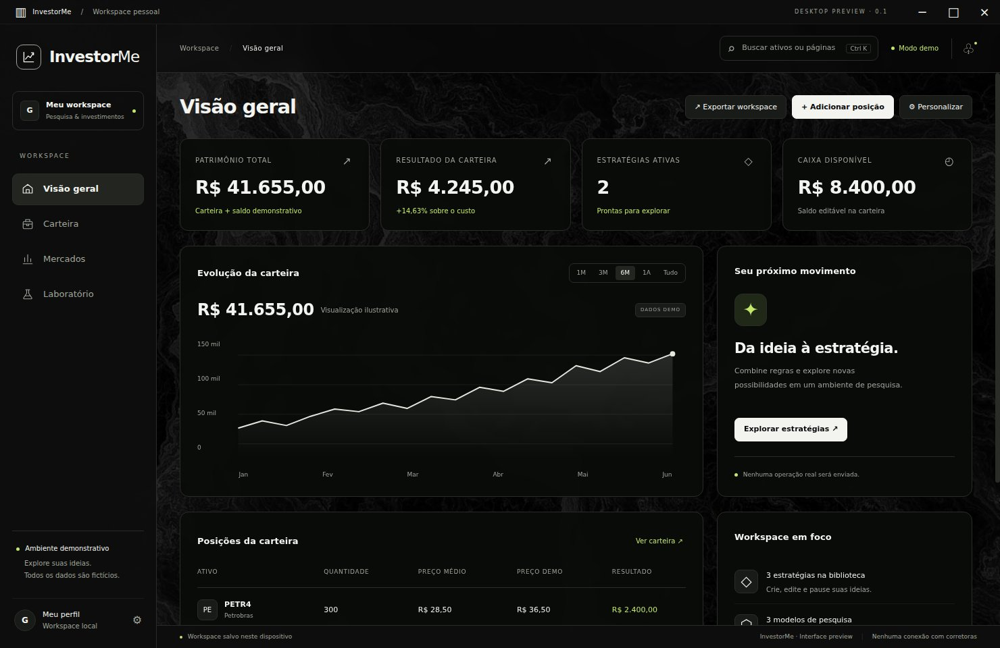
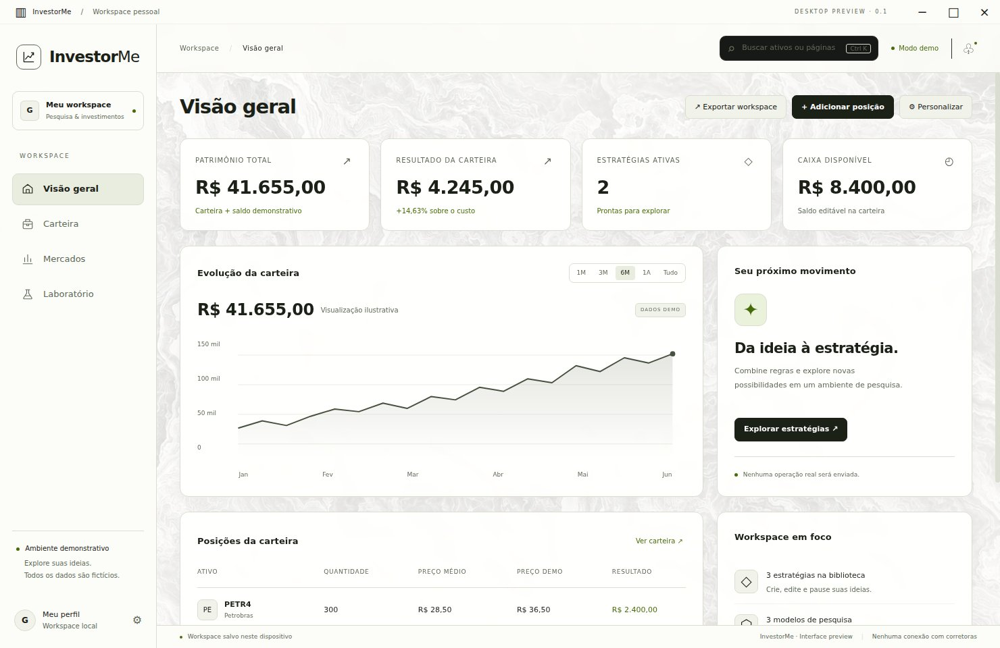

# InvestorMe

InvestorMe is an experimental desktop application for local portfolio tracking and investment research. It has an independent financial core, configurable brapi/Twelve Data integrations and a customizable Portuguese interface. The long-term goal is a reproducible research platform with strategy evaluation and probabilistic models.

**Current state: v0.1.0, reviewed on 2026-10-04.** The app starts empty. It does not generate fallback prices, portfolio charts, model predictions or backtest results. Missing market values display `—`; known user-entered cash and invested capital remain available. A zero-valued empty portfolio is not a market quote.

## Run

Install Node.js 22 LTS or later. Download or clone the current repository and run these commands in the directory containing `package.json`:

```powershell
npm ci
npm start
```

To receive data, open the profile gear → **Conta e configurações → Chaves de API**, click **+ → Adicionar chave**, choose a provider and paste its key. **Salvar e testar** applies it and checks the connection. Saved entries stay masked and show verification status. Settings apply without restarting. API access, delay and quota depend on your accounts; saving a key alone does not confirm access.

For source updates, close the app and update/download the repository again; downloading an old ZIP does not update automatically. Run `npm ci` in the updated folder before starting. Do not clear local application data to update. There is no in-app updater.

## Documentation

| Guide | Contents |
| --- | --- |
| [User guide — Português](docs/USER_GUIDE.md) | Installation, account keys, pages, portfolio, layouts, export and troubleshooting. |
| [Architecture](docs/ARCHITECTURE.md) | Financial contracts, dependency boundaries, precision, storage, migration and Electron security. |
| [Market data](docs/MARKET_DATA.md) | Provider routing, supported requests, authentication, timestamps, cache, errors and limitations. |
| [Development](docs/DEVELOPMENT.md) | Source map, commands, tests, Windows builds, workflow and contribution checks. |
| [Roadmap](docs/ROADMAP.md) | Implemented work, partial features and remaining technical stages. |
| [Long-term vision](docs/VISION.md) | Future engines, validation principles and hypothetical research workflows. |

## What exists today

| Area | Implemented | Not implemented |
| --- | --- | --- |
| Desktop and UI | Electron window, four main areas, internal sections, themes, density and persistent panel customization. | Cloud account/login and synchronization. |
| Financial core | `Asset`, `Quote`, `Candle`, `Position`, `Portfolio`, validation and decimal arithmetic for basic valuation. | Transaction ledger, realized P/L and FX conversion. |
| Portfolio | Position CRUD, manually entered cash, invested capital, market value, unrealized P/L and allocation when quotes are available. | Dividends/income engine, historical portfolio returns and benchmark comparison. |
| Markets | Metadata catalog, search, watchlist, timestamped quotes and daily asset OHLCV through brapi/Twelve Data. | Streaming, periodic polling, a complete exchange catalog and persistent history. |
| Account | Save/test/remove provider keys and disconnect; OS-protected storage or explicit session-only fallback. | Provider signup, subscription management and brokerage linking. |
| Research | Strategy/model configuration, associations, backtest parameter records and local Python/JavaScript text editing. | Strategy execution, model training, predictions, real backtesting and script execution. |
| Risk and alerts | Editable limits, simple uniform-price-drop arithmetic, local alert-rule CRUD/read state. | Statistical risk engine, continuous rule evaluation and notification delivery. |
| Persistence | localStorage workspace, native JSON export, legacy example migration and separately stored credentials. | JSON import UI, database and automatic backup/sync. |

Core types support extensible markets/currencies, but the current portfolio UI accepts B3 positions in BRL. US quotes can be inspected in Markets; they are not converted into BRL portfolio holdings. Mock data exists only in automated test fixtures and is excluded from the packaged application.

## Verification and packaging

```powershell
npm run check
npm test
npm run preview
npm run dist:win
```

Run these as separate tasks: `preview` starts a long-running server at `http://127.0.0.1:4173`. The browser preview is disconnected and has no credential configuration; use `npm start` for providers.

The last code validation passed syntax checks and **63 automated tests**, including real Electron UI interaction with controlled HTTP responses. It did not verify authenticated access to live provider accounts. The [development guide](docs/DEVELOPMENT.md) explains the test boundaries and build process.

The Windows build creates unsigned NSIS installer and portable executables in `release/`. The **Desktop preview** workflow runs checks/tests and then packages Windows, uploading `InvestorMe-Windows-x64` artifacts. It does not automatically publish a GitHub Release. A successful local test run is not proof that a Windows artifact was generated.

## Interface references

The current UI uses local topographic textures with dark, light and system modes. The nine catalog companies have locally bundled real logos; additional B3/NASDAQ/NYSE stocks automatically request logos from fixed public internet sources, falling back to the ticker if unavailable. [Logo sources](ui/assets/companies/README.md) are recorded separately. [Background provenance](ui/assets/README.md) describes the assets. The [initial mockups](assets/FirstInterfaceModel/readme.md) and screenshots below are historical visual references; their displayed example data is not loaded by the current app.





## Project principles

Keep financial rules independent of the interface and providers. Reject invalid values, preserve user records, display missing data honestly and keep secrets outside the workspace. Research results must eventually be reproducible, validated and clear about their assumptions. The planned engines are not guarantees of investment performance.

See [Development](docs/DEVELOPMENT.md#contributing) before contributing. No license file has been defined; do not assume an open-source license grant. Provider data remains subject to the applicable account permissions and terms.
