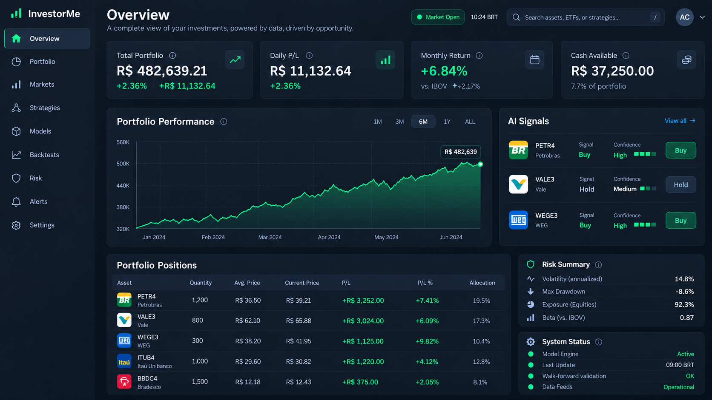
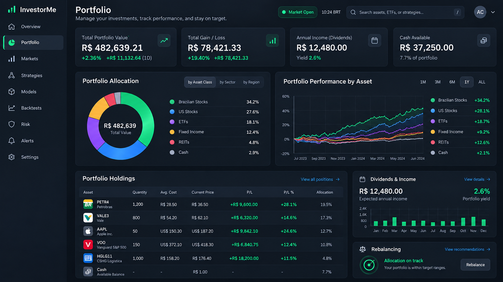
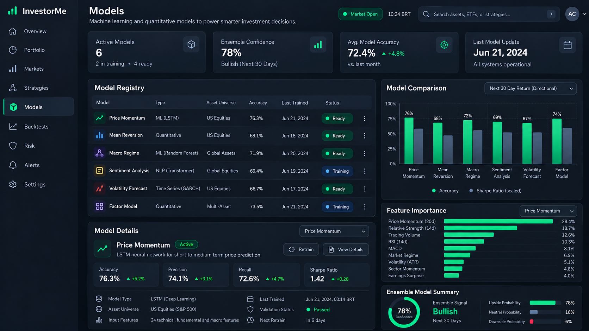
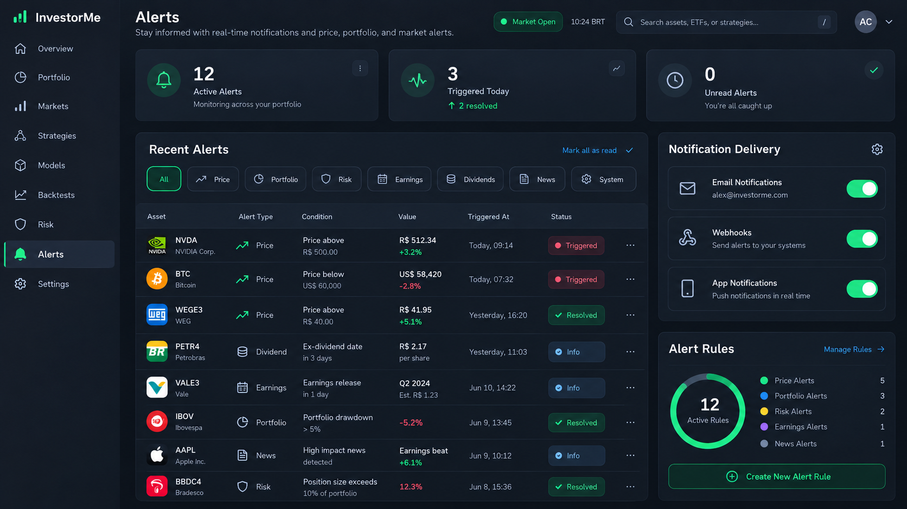
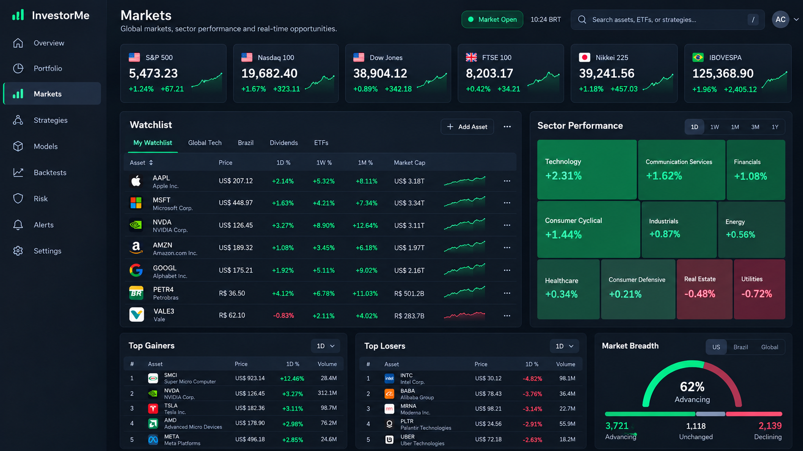
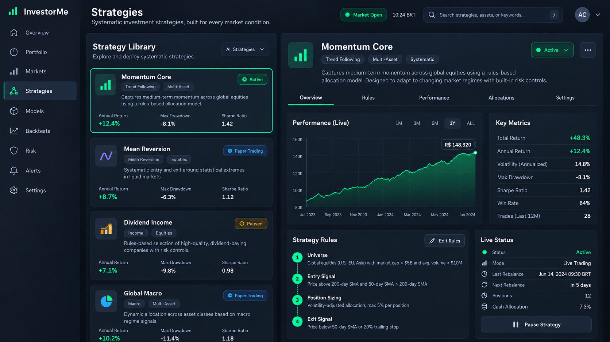
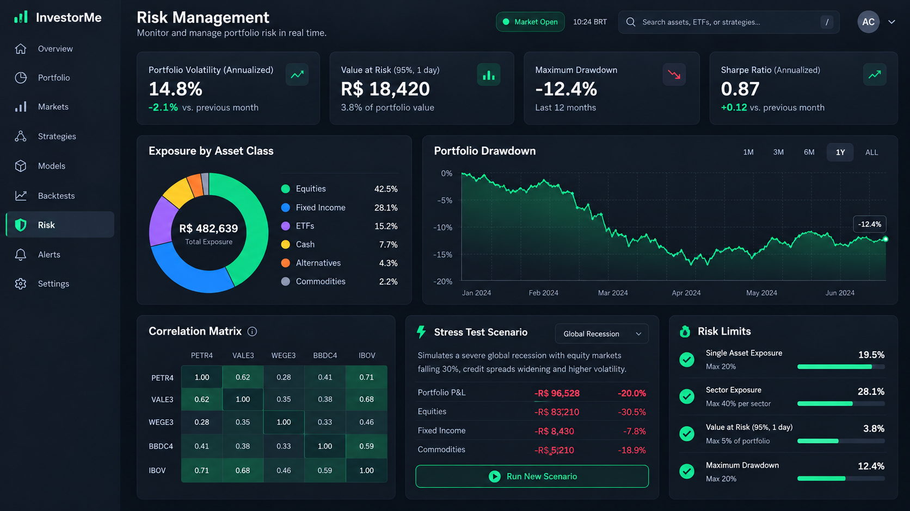
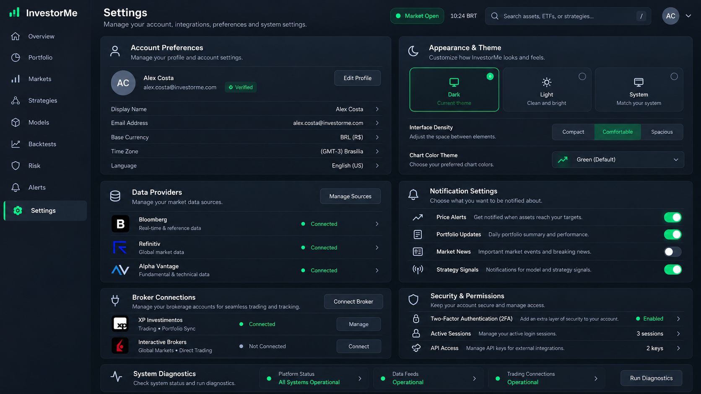

# Historical interface mockups

This folder preserves the **initial interface design references**. These are static mockups, not screenshots or a specification of the current implementation.

The images show the screens and user flow envisioned at that time. Any prices, balances, charts, predictions or results in them are illustrative and are not loaded by the current application.

## Screens

### Page 1

### Page 2

### Page 3

### Page 4

### Page 5

### Page 6

### Page 7

### Page 8

## Note

Current navigation, account connections and feature availability are documented in the [README](../../README.md) and [user guide](../../docs/USER_GUIDE.md). The application now starts with an empty workspace and no fabricated market data.
